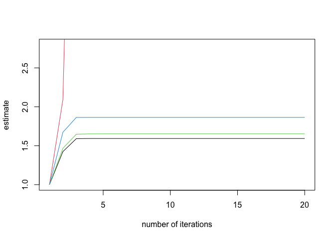

detectseparation
================

<!-- badges: start -->

<!-- badges: end -->

[**detectseparation**](https://github.com/ikosmidis/detectseparation)
provides *pre-fit* and *post-fit* methods for the detection of
separation and of infinite maximum likelihood estimates in binomial
response generalized linear models.

The key methods are `detect_separation` and `check_infinite_estimates`
and this vignettes describes their use.

Installation
------------

You can install the released version of detectseparation from
[CRAN](https://CRAN.R-project.org) with:

    install.packages("detectseparation")

And the development version from [GitHub](https://github.com/) with:

    # install.packages("devtools")
    devtools::install_github("ikosmidis/detectseparation")

Detecting and checking for Infinite maximum likelihood estimates
----------------------------------------------------------------

Heinze and Schemper (2002) used a logistic regression model to analyze
data from a study on endometrial cancer (see, Agresti 2015, Section 5.7
or `?endometrial` for more details on the data set). Below, we refit the
model in Heinze and Schemper (2002) in order to demonstrate the
functionality that **detectseparation** provides.

    library("detectseparation")
    data("endometrial", package = "detectseparation")
    endo_glm <- glm(HG ~ NV + PI + EH, family = binomial(), data = endometrial)
    theta_mle <- coef(endo_glm)
    summary(endo_glm)
    #> 
    #> Call:
    #> glm(formula = HG ~ NV + PI + EH, family = binomial(), data = endometrial)
    #> 
    #> Deviance Residuals: 
    #>      Min        1Q    Median        3Q       Max  
    #> -1.50137  -0.64108  -0.29432   0.00016   2.72777  
    #> 
    #> Coefficients:
    #>               Estimate Std. Error z value Pr(>|z|)    
    #> (Intercept)    4.30452    1.63730   2.629 0.008563 ** 
    #> NV            18.18556 1715.75089   0.011 0.991543    
    #> PI            -0.04218    0.04433  -0.952 0.341333    
    #> EH            -2.90261    0.84555  -3.433 0.000597 ***
    #> ---
    #> Signif. codes:  0 '***' 0.001 '**' 0.01 '*' 0.05 '.' 0.1 ' ' 1
    #> 
    #> (Dispersion parameter for binomial family taken to be 1)
    #> 
    #>     Null deviance: 104.903  on 78  degrees of freedom
    #> Residual deviance:  55.393  on 75  degrees of freedom
    #> AIC: 63.393
    #> 
    #> Number of Fisher Scoring iterations: 17

The maximum likelihood (ML) estimate of the parameter for `NV` is
actually infinite. The reported, apparently finite value is merely due
to false convergence of the iterative estimation procedure. The same is
true for the estimated standard error, and, hence the value
`r round(coef(summary(endo_glm))["NV", "z value"], 3)` for the
*z*-statistic cannot be trusted for inference on the size of the effect
for `NV`.

### `detect_separation`

`detect_separation` is *pre-fit* method, in the sense that it does not
need to estimate the model to detect separation and/or identify infinite
estimates. For example

    endo_sep <- glm(HG ~ NV + PI + EH, data = endometrial,
                    family = binomial("logit"),
                    method = "detect_separation")
    endo_sep
    #> Implementation: ROI | Solver: lpsolve 
    #> Separation: TRUE 
    #> Existence of maximum likelihood estimates
    #> (Intercept)          NV          PI          EH 
    #>           0         Inf           0           0 
    #> 0: finite value, Inf: infinity, -Inf: -infinity

So, the actual maximum likelihood estimates are

    coef(endo_glm) + coef(endo_sep)
    #> (Intercept)          NV          PI          EH 
    #>   4.3045178         Inf  -0.0421834  -2.9026056

and the estimated standard errors are

    coef(summary(endo_glm))[, "Std. Error"] + abs(coef(endo_sep))
    #> (Intercept)          NV          PI          EH 
    #>  1.63729861         Inf  0.04433196  0.84555156

### `check_infinite_estimates`

Lesaffre and Albert (1989, Section 4) describe a procedure that can hint
on the occurrence of infinite estimates. In particular, the model is
successively refitted, by increasing the maximum number of allowed
iteratively re-weighted least squares iterations at east step. The
estimated asymptotic standard errors from each step are, then, divided
to the corresponding ones from the first fit. If the sequence of ratios
diverges, then the maximum likelihood estimate of the corresponding
parameter is minus or plus infinity. The following code chunk applies
this process to `endo_glm`.

    (inf_check <- check_infinite_estimates(endo_glm))
    #>       (Intercept)           NV       PI       EH
    #>  [1,]    1.000000 1.000000e+00 1.000000 1.000000
    #>  [2,]    1.424352 2.092407e+00 1.466885 1.672979
    #>  [3,]    1.590802 8.822303e+00 1.648003 1.863563
    #>  [4,]    1.592818 6.494231e+01 1.652508 1.864476
    #>  [5,]    1.592855 7.911035e+02 1.652591 1.864492
    #>  [6,]    1.592855 1.588973e+04 1.652592 1.864493
    #>  [7,]    1.592855 5.298760e+05 1.652592 1.864493
    #>  [8,]    1.592855 2.332822e+07 1.652592 1.864493
    #>  [9,]    1.592855 2.332822e+07 1.652592 1.864493
    #> [10,]    1.592855 2.332822e+07 1.652592 1.864493
    #> [11,]    1.592855 2.332822e+07 1.652592 1.864493
    #> [12,]    1.592855 2.332822e+07 1.652592 1.864493
    #> [13,]    1.592855 2.332822e+07 1.652592 1.864493
    #> [14,]    1.592855 2.332822e+07 1.652592 1.864493
    #> [15,]    1.592855 2.332822e+07 1.652592 1.864493
    #> [16,]    1.592855 2.332822e+07 1.652592 1.864493
    #> [17,]    1.592855 2.332822e+07 1.652592 1.864493
    #> [18,]    1.592855 2.332822e+07 1.652592 1.864493
    #> [19,]    1.592855 2.332822e+07 1.652592 1.864493
    #> [20,]    1.592855 2.332822e+07 1.652592 1.864493
    #> attr(,"class")
    #> [1] "inf_check"
    plot(inf_check)

References
==========

Agresti, A. 2015. *Foundations of Linear and Generalized Linear Models*.
Wiley Series in Probability and Statistics. Wiley.

Heinze, G., and M. Schemper. 2002. “A Solution to the Problem of
Separation in Logistic Regression.” *Statistics in Medicine* 21:
2409–19.

Lesaffre, E., and A. Albert. 1989. “Partial Separation in Logistic
Discrimination.” *Journal of the Royal Statistical Society. Series B
(Methodological)* 51 (1): 109–16. <http://www.jstor.org/stable/2345845>.
